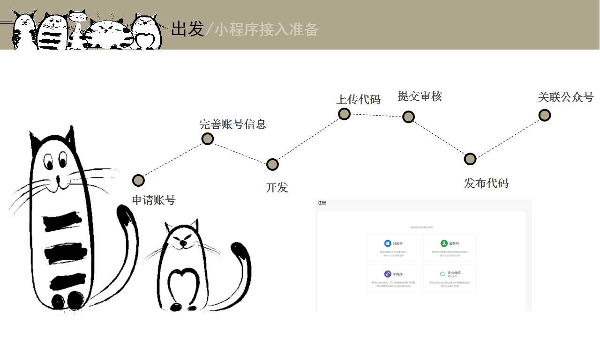
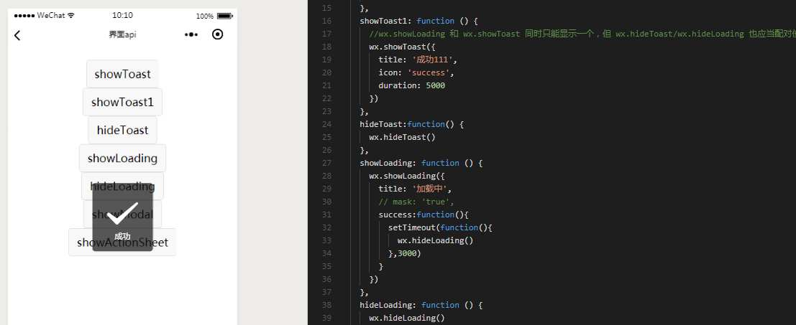

<h1 align="center">小程序开发经验分享
</h1>

  <b>——Calamus</b>
    
  

## 小程序start
### 小程序接入准备

### 小程序开发准备

- 完善小程序信息

- 下载开发者工具

- 用自己擅长的开发idea

- 查看api文档

## 小程序开发基础知识

### 小程序基础
#### 文件结构

#### 生命周期

#### 逻辑

#### 数据及事件绑定

### 小程序组件

#### view

#### scroll-view

#### movable-view

#### web-view

#### swiper

#### progress

#### slider

#### icon

#### 自定义组件

### 小程序常用api
#### 请求

#### 查看图片

#### 保存图片到相册

#### 用户授权

#### 获取用户信息

#### 获取用户信息

#### 获取地理位置

#### 文件上传下载

#### 界面

## demo演示

### 天气小程序

### 换头像小程序

### 233次元

## 小程序填坑

### 用户登录

### 自定义icon、字体

### setData

### 图片资源

### app.json配置文件

> [calamus.xyz](https://www.calamus.xyz) · GitHub [@calamus0427](https://github.com/calamus0427) 